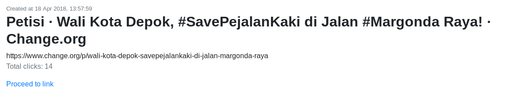

# Singkat: a Keyword-based URL Shortener and Click Tracker Module for Django Web Application

## Description

Singkat allows you to shorten long URL using your own unique keyword or (pseudo)random keyword, share it, and monitor the click stats. It can be used e.g. in an online campaign to track down the popularity and trends of related web pages.

Singkat is a standalone Django package with full web interface (currently styled using Bootstrap), so you can use this in your own web application built on Django 2 and have full control over all the click data.

The source code is licensed under simple and permissive MIT License. Also, this package is used as learning material for my colleagues who want to try Django.

## Technical Details

Singkat is built using Django 2.0.4. It utilizes [ipstack](https://ipstack.com/) API.

Some 3rd-party plugins and libs are used:

- requests          : HTTP library for Python ([link](http://docs.python-requests.org/en/master/))
- beautifulsoup4    : Python library for pulling data out of HTML and XML files ([link](https://www.crummy.com/software/BeautifulSoup/))
- highcharts.js     : free for non-commercial usage only ([official site](https://www.highcharts.com/blog/products/highcharts/))

## Installation

This repo contains the entire development project. The package is in the 'singkat' directory.

You need [ipstack](https://ipstack.com/) apikey. Their service is free for ten thousand requests per month. Define the `IPSTACK_APIKEY` var in your project's settings.py.

In your project's settings.py, add 'singkat' to `INSTALLED_APPS`:

```python
    INSTALLED_APPS = [
        ...,
        'singkat',
        ...
    ]
```

Add the singkat app's urls file to project's urls.py:

```python
    from django.urls import include, path
    ...
    urlpatterns = [
        ...
        path('your_pattern', include('singkat.urls')),
        ...
    ]
```

Replace `your_pattern` with value of your choice.

[Optional] Add the included middleware to solve problem with load balancer IP on some hosting service (e.g PythonAnywhere).

```python
    MIDDLEWARE = [
        ...
        # add the middleware before any other middleware that relies on the value of get_host()
        'singkat.middleware.multipleproxymiddleware.MultipleProxyMiddleware',
        ...
    ]
```

Finally, run 'migrate' command.

## Usage

Creating new singkat object (shortened url) with user generated keyword:

- Log in to your web application
- Create new singkat by entering unique keyword and target url

Monitoring singkats

- Go to Client Area and select one singkat you created earlier
- You will see the singkat's details and click data

### Previewing click
By default, appending '+' to singkat url will preview it so you know where you will be redirected to. For example, to preview 'http://sing.kat/YourKeyword', just enter 'http://sing.kat/YourKeyword+'.



## Contributing

You may either clone or just fork it. I had trouble with entity modeling and making efficient queries during development. Any issue report is welcome.

## License

See included MIT license.

## Screenshots

Check 'screenshots' directory for more screenshots of the user interface.
